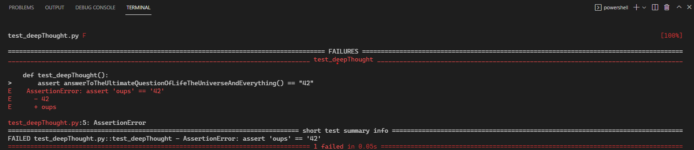

# Testing

## C’est quoi un test ?

Action manuelle ou automatisée vérifiant dans un contexte donné qu'un autre code a les effets attendus au regard d'un exemple d'un concept particulier.

## Pourquoi ?

Ecrire des tests automatisés offre plusieurs avantages :

- Valider que le code fait ce que l'on pense.
- Faciliter la détection des régressions.
- Faciliter le refactoring.
- Documenter le code.

## Test unitaire, test d’intégration, test fonctionnel, etc, quelles différences ?

Attention la taxonomie des tests et notamment la définition de "unitaire" est sans fin et peut différer en fonction des contextes d'entreprises. 

- **Unitaire :** test vérifiant les attendus d’une brique unitaire (fonction, classe, module, etc) d'un système. Ils sont généralement peu couteux à écrire car isolés et très rapides à executer.
- **Intégration**  : test vérifiant les attendus de sous ensembles d'un système une fois connectées ensemble. Ils sont généralement plus lents et plus couteux à mettre en place que les tests unitaires.
- **Fonctionnel** :  test vérifiant les attendus métier d’un système ou de sous ensembles de celui-ci.  Ils sont généralement plus lents et plus couteux à mettre en place que les tests unitaires.
- **Acceptance** : test vérifiant les attendus d’un cas d’usage métier d’un système ou de sous ensembles de celui-ci.  Ils sont généralement plus lents et plus couteux à mettre en place que les tests unitaires.
- **End 2 End :** test vérifiant les attendus d’un système ou les entrées sont une simulation d'un utilisateur réel via une IHM. Ils sont généralement très lents à executer et peuvent etre fragiles et compliqués à écrire.
- **Tests de performance, Test de sécurité, Tests exploratoires, Tests de mutation, Tests de propriétés, Tests de contrats, etc**

## Comment je m’y prends ?

Le pattern des 3A :

- **ARRANGE** : code permettant de mettre en place le contexte pour le code à tester.
    - *Exemple :* Etant donné A égal à 10 et B égal à 2.
- **ACT** : code exécutant l’action qu’on cherche à valider.
    - *Exemple :* Quant on divise A par B.
- **ASSERT** :  code vérifiant les effets attendus du code testé.
    - *Exemple :* Alors on doit obtenir 2.

Dans le meme esprit, il existe une variante avec le pattern : **GIVEN, WHEN, THEN**

## Ok mais je vérifie quoi ?

On vérifie généralement les effets attendus d'exemples de deux types de cas d'utilisation :

- **Cas nominal** : cas ou les exemples d'utilisation correspondent aux cas généraux (happy path).
    - *Exemple :* Prenons le cas de la division, des exemples de cas généraux sont 1/2, 3/7, etc.
- **Cas à la marge** : cas ou les exemples d'utilisation correspondent à des erreurs, des exceptions, des cas non généraux.
    - *Exemple :* Prenons le cas de la division, un exemple de cas à la marge est la division par 0.

## Ça marche ! Et de quoi j'ai besoin ?

De quoi écrire les tests (bibliothèque de tests, bibliothèque d'assertions) et de quoi exécuter les tests (test runner). Dans la grande majorité des cas les frameworks de tests contiennent tout ce qu'il faut pour démarrer (tests, assertions, runner).

## Mise en pratique

**Objectif** : Ecrire son premier test

**Temps** : 15 minutes

- **L'initialisation**
    
    Lancer les commandes dans un shell :
    
    ```bash
    mkdir src
    cd src
    "" > deepThought.py
    "" > test_deepThought.py
    python -m pip install pytest
    ```
    
- **Le code à tester**
    
    Ecrire dans le fichier `deepThought.py` :
    
    ```python
    def answerToTheUltimateQuestionOfLifeTheUniverseAndEverything():
        return "oups"
    ```
    
- **Le code de test**
    
    Ecrire dans le fichier `test_deepThought.py` :
    
    ```python
    import pytest
    from deepThought import answerToTheUltimateQuestionOfLifeTheUniverseAndEverything
    
    def test_deepThought():
    	assert answerToTheUltimateQuestionOfLifeTheUniverseAndEverything() == "42"
    ```
    
- **Lancer les tests**
    
    Lancer la commande `python -m pytest` dans un shell :
    
    
    

## C'est quoi les bonnes pratiques ?

Ecrire des tests unitaires de bonne qualité necessite de suivre quelques règles :

- **Fast** : les tests doivent etre rapides à l'execution afin d'obtenir une bonne expèrience développeur.
- **Independent** : les tests doivent etre isolés et ne pas dépendre entre eux ou de dépendances tierces.
- **Repeatable** : les tests doivent etre deterministes et ne pas varier en fonction d'éléments extérieurs.
- **Self-validating** : les tests doivent auto-suffisants et se suffire à eux-meme afin de déterminer un succès ou un échec.
- **Through** : les tests doivent aussi bien prendre en considération le happy path que les scénarios négatifs.


## C'est quoi les bonnes pratiques ?

Ecrire des tests unitaires de bonne qualité necessite de suivre quelques règles :

- **Fast** : les tests doivent etre rapides à l'execution afin d'obtenir une bonne expèrience développeur.
- **Independent** : les tests doivent etre isolés et ne pas dépendre entre eux ou de dépendances tierces.
- **Repeatable** : les tests doivent etre deterministes et ne pas varier en fonction d'éléments extérieurs.
- **Self-validating** : les tests doivent auto-suffisants et se suffire à eux-meme afin de déterminer un succès ou un échec.
- **Through** : les tests doivent aussi bien prendre en considération le happy path que les scénarios négatifs.

## Et sinon TDD (Test Driven Development) ?

TDD n’est pas une technique d’écriture de tests mais un cycle de développement guidé par les tests (le fait d’avoir des tests est une conséquence du cycle) :

- **RED** : écrire un test et le faire échouer.
- **GREEN** : écrire le code de production minimum permettant de faire passer le test en succès.
- **REFACTOR** : nettoyer le code (Duplication, Lisibilité, Code Smells...).

Et on recommence :) Ecrire des tests unitaires avec TDD offre plusieurs avantages :

- Clarifie l'objectif avant de passer à l'implémentation du code.
- Encourage le développement incrémetal grace aux baby steps.
- Décourage le couplage de code et l'over engineering.

## Mise en pratique

**Objectif** : Initiation à TDD

**Temps** : 30 minutes

- **Le métier**
    
    Construire une fonction fizzBuzz qui transforme un entier en chaine de caractères selon les règles suivantes :
    
    - Pour les multiples de 3, remplacer le nombre par Fizz
    - Pour les multiples de 5, remplacer le nombre par Buzz
    - Pour les multiples et 3 et de 5, remplacer le nombre par FizzBuzz
    - Pour les autres nombres, retourner le nombre
    
    ```bash
    1 => 1
    2 => 2
    3 => Fizz
    4 => 4
    5 => Buzz
    6 => Fizz
    15 => FizzBuzz
    ```
    
- **L'initialisation**
    
    Lancer les commandes dans un shell :
    
    ```bash
    mkdir src
    cd src
    "" > fizzbuzz.py
    "" > test_fizzbuzz.py
    python -m pip install pytest
    ```
    
- **Itération 1**
    - **RED**
        
        Ecrire un test dans le fichier `test_fizzbuzz.py` et le faire échouer :
        
        ```python
        import pytest
        from fizzbuzz import fizzbuzz
        
        def test_siNombreEstUnAlors1():
        	assert fizzbuzz(1) == "1"
        ```
        
    - **GREEN**
        
        Ecrire le code de production minimum dans le fichier `fizzbuzz.py` permettant de faire passer le test en succès :
        
        ```python
        def fizzbuzz(entry):
        	return "1"
        ```
        
    - **REFACTOR**
        
        RAS
        
- **Itération 2**
    - **RED**
        
        Ecrire un test dans le fichier `test_fizzbuzz.py` et le faire échouer :
        
        ```python
        // siNombreEstUnAlors1
        
        def test_siNombreNiMultipleDeTroisNiMultipleDeCinqAlorsNombre():
        	assert fizzbuzz(2) == "2"
        ```
        
    - **GREEN**
        
        Ecrire le code de production minimum dans le fichier `fizzbuzz.py` permettant de faire passer le test en succès :
        
        ```python
        def fizzbuzz(entry):
        	return str(entry);
        ```
        
    - **REFACTOR**
        
        Nettoyer le code :
        
        ```python
        casesNotMultipleOf3Nor5 = [(1, "1"), (2, "2")]
        
        @pytest.mark.parametrize("entry,expected", casesNotMultipleOf3Nor5)
        def test_siNombreNiMultipleDeTroisNiMultipleDeCinqAlorsNombre(entry, expected):
        	assert fizzbuzz(entry) == expected
        ```
        
- **Itération 3**
    - **RED**
        
        Ecrire un test dans le fichier `test_fizzbuzz.py` et le faire échouer :
        
        ```python
        // siNombreNiMultipleDeTroisNiMultipleDeCinqAlorsNombre
        
        def test_siNombreMultipleDeTroisAlorsFizz():
        	assert fizzbuzz(3) == "Fizz"
        ```
        
    - **GREEN**
        
        Ecrire le code de production minimum dans le fichier `fizzbuzz.py` permettant de faire passer le test en succès :
        
        ```python
        def fizzbuzz(entry):
        	if entry == 3:
            return 'Fizz'
        	else:
        		return str(entry);
        ```
        
    - **REFACTOR**
        
        RAS
        
- **Itération 4**
    - **RED**
        
        Ecrire un test dans le fichier `test_fizzbuzz.py` et le faire échouer :
        
        ```tsx
        // siNombreNiMultipleDeTroisNiMultipleDeCinqAlorsNombre
        
        casesFizz = [(3, "Fizz"), (6, "Fizz")]
        
        @pytest.mark.parametrize("entry,expected", casesFizz)
        def test_siNombreMultipleDeTroisAlorsFizz(entry, expected):
        	assert fizzbuzz(entry) == expected
        ```
        
    - **GREEN**
        
        Ecrire le code de production dans le fichier `fizzbuzz.py` minimum permettant de faire passer le test en succès :
        
        ```python
        def fizzbuzz(entry):
          if entry % 3 == 0: 
        		return "Fizz"
        	else:
        		return str(entry)
        ```
        
    - **REFACTOR**
        
        Nettoyer le code :
        
        ```python
        def fizzbuzz(entry):
          if isMultipleOf3(entry): 
        		return "Fizz"
        	else:
        		return str(entry)
        
        def isMultipleOf3(number): 
          return number % 3 == 0
        ```

## Exercice

**Objectif** : Pratique de TDD

**Temps** : 60 à 90 minutes

**Sujet** : [Tennis Kata](https://codingdojo.org/fr/kata/Tennis/)

## Les doublures/simulacres

Permet de simuler l'utilisation de dépendances necessaire à l'unité en isolation testée comme un composant non disponible, une application non accessible pendant la phase de développement (API HTTP Tier, ...) , un élément complexe ou long à charger (Base de données, ...)

### Dummy

Toutes les méthodes lèveront une exception si elles sont appelées car seule la présence de le dépendance est utile pour faire compiler.

### Stub 

Une ou plusieurs méthodes sont prévues pour renvoyer toujours la même valeur fixe quelques soient les paramètres qui lui sont passés.

### Mock

Implémentations simplistes des méthodes proche du Stub mais avec des traitements conditionnels ne gérant que quelques cas.


### Fake

Mime fidèlement le comportement à simuler. Il mime de manière poussée la logique et le comportement métier de l'élément auquel il se substitue sans pour autant avoir d'interaction avec le monde réel.

### Spy

Permet de vérifier, compter, enregistrer que les appels à une méthode sont effectués.


### J'ai mal à mes dépendances...

Afin de réaliser les attendus, un système nécessite bien souvent des dépendances, parfois explicites, parfois implicites. Dans le cadre des tests automatisés, il est souhaitable de pouvoir les isoler afin de les contrôler et ainsi maitriser totalement le contexte.

```
class LunchService():
    def is_it_time_to_eat(self):
        # DateTime.Now est une dépendance implicites et non maitrisée
        return datetime.now().hour >= 12 and datetime.now().hour <= 14
```

### Passage par valeur

```
class LunchService():
    def is_it_time_to_eat(self, now):
        # now est maintenant une dépendance explicite et controllée par extérieur
        return now.hour >= 12 and now.hour <= 14

def test_should_be_lunch_time_when_its_13h():
    lunchService = LunchService()

    dt = datetime(2026, 1, 1, 13, 30)

    assert lunchService.is_it_time_to_eat(dt) == True
```

### Passage par délégué

```
class LunchService():
    def is_it_time_to_eat(self, getNow):
        # getNow() est maintenant une dépendance explicite et controllée par extérieur
        return getNow().hour >= 12 and getNow().hour <= 14

def test_should_be_lunch_time_when_its_13h():
    lunchService = LunchService()

    getNow = lambda : datetime(2026, 1, 1, 13, 30)

    assert lunchService.is_it_time_to_eat(getNow) == True
```

### Passage par contrat

```
class Clock():
    def getNow():
        return datetime.now()
    
class LunchService():
    # clock est maintenant une dépendance implicite et controllée par extérieur
    def is_it_time_to_eat(self, c):
        return c.getNow().hour
        return c.getNow().hour >= 12 and c.getNow().hour <= 14

class FakeClock():
    def __init__(self, dt):
        self.dt = dt

    def getNow(self):
        print(self.dt)
        return self.dt.now()

def test_3should_be_lunch_time_when_its_13h():
    lunchService = LunchService()

    clock = FakeClock(datetime(2026, 1, 1, 12, 30))

    assert lunchService.is_it_time_to_eat(clock) == ""
```

### Surcharge par héritage

```
class LunchService():
    # heritage
    def is_it_time_to_eat(self):
        return self.getNow().hour >= 12 and self.getNow().hour <= 14
    
    def getNow(self):
        return datetime.now()
    
class LunchServiceWithFakeGetNow(LunchService):
    def __init__(self, now):
        self.now = now

    def getNow(self):
        return self.now
    
def test_lunchService(mocker):
    service = LunchServiceWithFakeGetNow(datetime(2026,1,1,13,30))

    assert service.is_it_time_to_eat() == True
```

### Exemple pytest-mock

```
def test_lunchService(mocker):
    service = LunchService()

    # Dummy
    dummy = mocker.Mock()

    # Stub
    stub = mocker.Mock()
    stub.p1 = ""
    stub.method1.return_value("YourValue")
    assert stub.assert_called_once_with()

    # Spy
    objectToSpy = mocker.spy(FakeClock, "getNow")

    assert objectToSpy.call_count == 1
``` 

## Exercice

**Objectif** : Pratique de TDD avec des doublures

**Temps** : 60 à 90 minutes

**Sujet** : [Unusual spending](https://kata-log.rocks/unusual-spending-kata)
