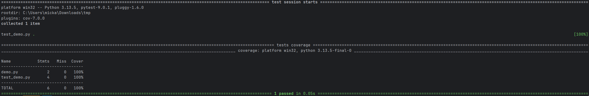
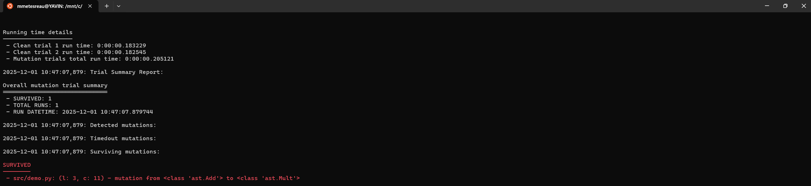

# Software Quality

## C'est quoi la qualité logicielle ?

Comment définir la qualité d'un logiciel ? Performance, fiabilité, maintenabilité, fonctionnalité, etc ? Probablement un ensemble de tous ces critères.

## Pourquoi ?

La qualité ou plus exactement le manque de qualité coute cher en terme d'argent, de réputation, d'ambiance de travail, etc.

## Quels acteurs ?

Même si le code est produit par des développeurs, il est nécessaire de comprendre la qualité logicielle comme un résultat global nécessitant l'implication et le support de tous les acteurs : du client, au testeur, en passant par le manager jusqu'au développeur.

## Quels leviers ?

La qualité logicielle est une démarche continue propre à chaque contexte passant aussi bien par les processus organisationnels que par les processus opérationnels. Elle peut être, bien entendue, facilité par l'utilisation d'outils adéquats comme des IDEs, des usines logiciels mais est aussi affaire de pratiques, d'apprentissage, d'entrainement et donc de temps de montée en compétences. C'est pourquoi le **Clean Code**, le **Craft**, le **TDD**, le **DDD** sont des boites à outils utiles mais pas auto-suffisantes.

## Un point sur les métriques

La qualité logicielle étant une démarche continue, il est intéressant de pouvoir suivre et mesurer l'évolution de celle-ci au cours du temps via des métriques telles que le code coverage, le pourcentage de duplication, le nombre de ligne de code, etc tout en gardant à l'esprit que ces métriques ne sont pas absolues.

# Testing

## C’est quoi un test ?

Action manuelle ou automatisée vérifiant dans un contexte donné qu'un bloc code a les effets attendus au regard d'un exemple d'un concept particulier.

## Pourquoi ?

Ecrire des tests automatisés offre plusieurs avantages :

- Valider que le code fait ce que l'on pense.
- Faciliter la détection des régressions.
- Faciliter le refactoring.
- Documenter le code.

## Test unitaire, test d’intégration, etc, quelles différences ?

- **End 2 End :** test vérifiant les attendus d’un système ou les entrées sont une simulation d'un utilisateur réel via une IHM. Ils sont généralement très lents à executer et peuvent etre fragiles et compliqués à écrire.
- **Intégration :** test vérifiant les attendus de sous ensembles d'un système une fois connectées ensemble. 
- **Unitaire :** test vérifiant les attendus d’une brique unitaire (fonction, classe, module, etc) d'un système. 

Attention la taxonomie des tests et notamment la définition de "unitaire" est sans fin et peut différer en fonction des contextes d'entreprises. 

Une autre manière de définir un test unitaire est via le respect des propriétés suivantes :

- **Fast** : les tests doivent etre rapides à l'execution afin d'obtenir une bonne expèrience développeur.
- **Independent** : les tests doivent etre isolés et ne pas dépendre entre eux ou de dépendances tierces.
- **Repeatable** : les tests doivent etre deterministes et ne pas varier en fonction d'éléments extérieurs.
- **Self-validating** : les tests doivent auto-suffisants et se suffire à eux-meme afin de déterminer un succès ou un échec.
- **Thorough** : les tests doivent aussi bien prendre en considération le happy path que les scénarios négatifs

Il est important de garder à l'esprit de maintenir une qualité de code élevée lors de l'écriture des tests afin de rendre ceux-ci le plus maintenable, évolutif et lisible dans le temps. Ils doivent etre autant considérer que du code de production.

## Comment je m’y prends ?

Le pattern des 3A :

- **ARRANGE** : code permettant de mettre en place le contexte pour le code à tester.
    - *Exemple :* Etant donné A égal à 10 et B égal à 2.
- **ACT** : code exécutant l’action qu’on cherche à valider.
    - *Exemple :* Quant on divise A par B.
- **ASSERT** :  code vérifiant les effets attendus du code testé.
    - *Exemple :* Alors on doit obtenir 2.

Dans le meme esprit, il existe une variante avec le pattern : **GIVEN, WHEN, THEN**

## Ok mais je vérifie quoi ?

La vérification des effets attendus s'effectue des exemples de deux types de cas d'utilisation :

- **Cas nominal** : cas où les exemples d'utilisation correspondent aux cas généraux (happy path).
    - *Exemple :* Prenons le cas de la division, des exemples de cas généraux sont 1/2, 3/7, etc.
- **Cas à la marge** : cas où les exemples d'utilisation correspondent à des erreurs, des exceptions, des cas non généraux.
    - *Exemple :* Prenons le cas de la division, un exemple de cas à la marge est la division par 0.

## Ça marche ! Et de quoi j'ai besoin ?

De quoi écrire les tests (bibliothèque de tests, bibliothèque d'assertions) et de quoi exécuter les tests (test runner). Dans la grande majorité des cas les frameworks de tests contiennent tout ce qu'il faut pour démarrer (tests, assertions, runner).

## Mise en pratique

**Objectif** : Ecrire son premier test

**Temps** : 15 minutes

- **L'initialisation**
    
    Lancer les commandes dans un shell :
    
    ```bash
    mkdir src
    cd src
    "" > deepThought.py
    "" > test_deepThought.py
    python -m pip install pytest
    ```
    
- **Le code à tester**
    
    Ecrire dans le fichier `deepThought.py` :
    
    ```python
    def answerToTheUltimateQuestionOfLifeTheUniverseAndEverything():
        return "oups"
    ```
    
- **Le code de test**
    
    Ecrire dans le fichier `test_deepThought.py` :
    
    ```python
    import pytest
    from deepThought import answerToTheUltimateQuestionOfLifeTheUniverseAndEverything
    
    def test_deepThought():
    	assert answerToTheUltimateQuestionOfLifeTheUniverseAndEverything() == "42"
    ```
    
- **Lancer les tests**
    
    Lancer la commande `python -m pytest` dans un shell :
    
    
 
## Un mot sur le code coverage

Le code coverage permet d'obtenir un score indiquant le taux de couverture de tests pour une base de code.

```python
def inc(x):
    return x + 1
    
def test_assert():
    result = inc(5)

    assert resultat == 6
```

```bash
python -m pip install pytest-cov
python -m pytest --cov
```



## Un mot sur le mutation Testing

Le mutation testing permet de vérifier que les assertions valident bien un produit du code testé.

```python
def inc(x):
    return x + 1
    
def test_useless_assert():
    result = inc(5)

    assert 1 == 1
```

```bash
pip install mutatest
mutatest
```



## Stratégies de test

- **Test after :** l'écriture des tests se fait après l'écriture du code de production.
- **Test first :** l'écriture des tests se fait en amont de l'écriture du code de production.

## Et sinon TDD (Test Driven Development) ?

TDD n’est pas une technique d’écriture de tests mais un cycle de développement guidé par les tests (le fait d’avoir des tests est une conséquence du cycle) :

- **RED** : écrire un test et le faire échouer.
- **GREEN** : écrire le code de production minimum permettant de faire passer le test en succès.
- **REFACTOR** : nettoyer le code (Duplication, Lisibilité, Code Smells...).

Et on recommence :) Ecrire des tests unitaires avec TDD offre plusieurs avantages :

- Clarifie l'objectif avant de passer à l'implémentation du code.
- Encourage le développement incrémetal grace aux baby steps.
- Décourage le couplage de code et l'over engineering.

## Patterns TDD

- **Baby steps :** toujours tenter de faire des doubles TDD les plus petites et rapides possible.
- **Fake it ('Til you make it)** : toujours écrire le minimum de code nécessaire pour passer de l'étape RED à l'étape GREEN.
- **Triangulate :** dans le cas la solution est inconnue, il est conseillé d'exécuter plusieurs boucles TDD afin de faire émerger une implémentation de manière itérative.
- **Obvious implementation :** : dans le cas où la solution est évidente et déjà connue, il est autorisé d'écrire directement une implémentation.

### Antipatterns TDD

- **Excessive setup :** un test qui nécessite enormement de code de setup.
- **The giant :** un test qui assert beaucoup de choses différentes.
- **The liar :** un test qui ne passe jamais au rouge.
- **The inspector :** un test qui viole le principe d'encapsulation. 
- **The slow poke :** un test extrement lent a exécuter. 

## Mise en pratique

**Objectif** : Initiation à TDD

**Temps** : 30 minutes

- **Le métier**
    
    Construire une fonction fizzBuzz qui transforme un entier en chaine de caractères selon les règles suivantes :
    
    - Pour les multiples de 3, remplacer le nombre par Fizz
    - Pour les multiples de 5, remplacer le nombre par Buzz
    - Pour les multiples et 3 et de 5, remplacer le nombre par FizzBuzz
    - Pour les autres nombres, retourner le nombre
    
    ```bash
    1 => 1
    2 => 2
    3 => Fizz
    4 => 4
    5 => Buzz
    6 => Fizz
    15 => FizzBuzz
    ```
    
- **L'initialisation**
    
    Lancer les commandes dans un shell :
    
    ```bash
    mkdir src
    cd src
    "" > fizzbuzz.py
    "" > test_fizzbuzz.py
    python -m pip install pytest
    ```
    
- **Itération 1**
    - **RED**
        
        Ecrire un test dans le fichier `test_fizzbuzz.py` et le faire échouer :
        
        ```python
        import pytest
        from fizzbuzz import fizzbuzz
        
        def test_siNombreEstUnAlors1():
        	assert fizzbuzz(1) == "1"
        ```
        
    - **GREEN**
        
        Ecrire le code de production minimum dans le fichier `fizzbuzz.py` permettant de faire passer le test en succès :
        
        ```python
        def fizzbuzz(entry):
        	return "1"
        ```
        
    - **REFACTOR**
        
        RAS
        
- **Itération 2**
    - **RED**
        
        Ecrire un test dans le fichier `test_fizzbuzz.py` et le faire échouer :
        
        ```python
        // siNombreEstUnAlors1
        
        def test_siNombreNiMultipleDeTroisNiMultipleDeCinqAlorsNombre():
        	assert fizzbuzz(2) == "2"
        ```
        
    - **GREEN**
        
        Ecrire le code de production minimum dans le fichier `fizzbuzz.py` permettant de faire passer le test en succès :
        
        ```python
        def fizzbuzz(entry):
        	return str(entry);
        ```
        
    - **REFACTOR**
        
        Nettoyer le code :
        
        ```python
        casesNotMultipleOf3Nor5 = [(1, "1"), (2, "2")]
        
        @pytest.mark.parametrize("entry,expected", casesNotMultipleOf3Nor5)
        def test_siNombreNiMultipleDeTroisNiMultipleDeCinqAlorsNombre(entry, expected):
        	assert fizzbuzz(entry) == expected
        ```
        
- **Itération 3**
    - **RED**
        
        Ecrire un test dans le fichier `test_fizzbuzz.py` et le faire échouer :
        
        ```python
        // siNombreNiMultipleDeTroisNiMultipleDeCinqAlorsNombre
        
        def test_siNombreMultipleDeTroisAlorsFizz():
        	assert fizzbuzz(3) == "Fizz"
        ```
        
    - **GREEN**
        
        Ecrire le code de production minimum dans le fichier `fizzbuzz.py` permettant de faire passer le test en succès :
        
        ```python
        def fizzbuzz(entry):
        	if entry == 3:
            return 'Fizz'
        	else:
        		return str(entry);
        ```
        
    - **REFACTOR**
        
        RAS
        
- **Itération 4**
    - **RED**
        
        Ecrire un test dans le fichier `test_fizzbuzz.py` et le faire échouer :
        
        ```tsx
        // siNombreNiMultipleDeTroisNiMultipleDeCinqAlorsNombre
        
        casesFizz = [(3, "Fizz"), (6, "Fizz")]
        
        @pytest.mark.parametrize("entry,expected", casesFizz)
        def test_siNombreMultipleDeTroisAlorsFizz(entry, expected):
        	assert fizzbuzz(entry) == expected
        ```
        
    - **GREEN**
        
        Ecrire le code de production dans le fichier `fizzbuzz.py` minimum permettant de faire passer le test en succès :
        
        ```python
        def fizzbuzz(entry):
          if entry % 3 == 0: 
        		return "Fizz"
        	else:
        		return str(entry)
        ```
        
    - **REFACTOR**
        
        Nettoyer le code :
        
        ```python
        def fizzbuzz(entry):
          if isMultipleOf3(entry): 
        		return "Fizz"
        	else:
        		return str(entry)
        
        def isMultipleOf3(number): 
          return number % 3 == 0
        ```

## Exercice

**Objectif** : Pratique de TDD

**Temps** : 60 à 90 minutes

**Sujet** : [Tennis Kata](https://codingdojo.org/fr/kata/Tennis/)

## J'ai mal à mes dépendances...

Afin de réaliser les attendus, un système nécessite bien souvent des dépendances, parfois explicites, parfois implicites. Dans le cadre des tests automatisés, il est necessaire de les isoler afin de les contrôler et ainsi de maitriser totalement le contexte.

```python
class LunchService():
    def is_it_time_to_eat(self):
        # DateTime.Now est une dépendance implicites et non maitrisée
        return datetime.now().hour >= 12 and datetime.now().hour <= 14
```

### Passage par valeur

```python
class LunchService():
    def is_it_time_to_eat(self, now):
        # now est maintenant une dépendance explicite et controllée par extérieur
        return now.hour >= 12 and now.hour <= 14

def test_should_be_lunch_time_when_its_13h():
    lunchService = LunchService()

    dt = datetime(2026, 1, 1, 13, 30)

    assert lunchService.is_it_time_to_eat(dt) == True
```

### Passage par délégué

```python
class LunchService():
    def is_it_time_to_eat(self, getNow):
        # getNow() est maintenant une dépendance explicite et controllée par extérieur
        return getNow().hour >= 12 and getNow().hour <= 14

def test_should_be_lunch_time_when_its_13h():
    lunchService = LunchService()

    getNow = lambda : datetime(2026, 1, 1, 13, 30)

    assert lunchService.is_it_time_to_eat(getNow) == True
```

### Passage par contrat

```python
class Clock():
    def getNow():
        return datetime.now()
    
class LunchService():
    # clock est maintenant une dépendance implicite et controllée par extérieur
    def is_it_time_to_eat(self, c):
        return c.getNow().hour
        return c.getNow().hour >= 12 and c.getNow().hour <= 14

class FakeClock():
    def __init__(self, dt):
        self.dt = dt

    def getNow(self):
        print(self.dt)
        return self.dt.now()

def test_3should_be_lunch_time_when_its_13h():
    lunchService = LunchService()

    clock = FakeClock(datetime(2026, 1, 1, 12, 30))

    assert lunchService.is_it_time_to_eat(clock) == ""
```

### Surcharge par héritage

```python
class LunchService():
    # heritage
    def is_it_time_to_eat(self):
        return self.getNow().hour >= 12 and self.getNow().hour <= 14
    
    def getNow(self):
        return datetime.now()
    
class LunchServiceWithFakeGetNow(LunchService):
    def __init__(self, now):
        self.now = now

    def getNow(self):
        return self.now
    
def test_lunchService(mocker):
    service = LunchServiceWithFakeGetNow(datetime(2026,1,1,13,30))

    assert service.is_it_time_to_eat() == True
```

## Les doublures/simulacres

Afin de simuler les comportements des dépendances necessaires à l'unité testée en isolation, différents types de Test Doubles peuvent etre utiliser.
*Exemple :* un composant non disponible, une application non accessible pendant la phase de développement (API HTTP Tier, ...) , un élément complexe ou long à charger (Base de données, ...).

- **Dummy :** Toutes les méthodes lèveront une exception si elles sont appelées car seule la présence de le dépendance est utile pour faire compiler.
- **Stub :** Une ou plusieurs méthodes sont prévues pour renvoyer toujours la même valeur fixe quelques soient les paramètres qui lui sont passés.
- **Mock :** Implémentations simplistes des méthodes proche du Stub mais avec des traitements conditionnels ne gérant que quelques cas.
- **Fake :** Mime fidèlement le comportement à simuler. Il mime de manière poussée la logique et le comportement métier de l'élément auquel il se substitue sans pour autant avoir d'interaction avec le monde réel.
- **Spy :** Permet de vérifier, compter, enregistrer que les appels à une méthode sont effectués.

## Mise en pratique

**Objectif** : Ecrire son premier mock

**Temps** : 15 minutes

- **L'initialisation**
    
    Lancer les commandes dans un shell :
    
    ```bash
    mkdir src
    cd src
    "" > doubles.py
    "" > test_doubles.py
    python -m pip install pytest
    ```
    
- **Le code à tester**
    
    Ecrire dans le fichier `doubles.py` :
    
    ```python
    def iDoStuffWithSomeCollaborators(bdd, notifier):
        data = bdd.getData()
        notifier.notify("alert " + data)
        pass
    ```
    
- **Le code de test**
    
    Ecrire dans le fichier `test_doubles.py` :
    
    ```python
    import pytest
    from doubles import iDoStuffWithSomeCollaborators
    
    def test_iDoStuffWithSomeCollaborators(mocker):
        bdd = mocker.Mock()
        bdd.getData.return_value = "some data"
    
        notifier = mocker.Mock()
    
    	iDoStuffWithSomeCollaborators(bdd, notifier)

        notifier.notify.assert_called_with("alert some data")
    ```
    
- **Lancer les tests**
    
    Lancer la commande `python -m pytest` dans un shell.
  
### Cheat Sheet pytest-mock

- **return_value :** configure la valeur retournée par le mock.
- **side_effect :** configure les valeurs ou l'exception ou le comportement retourné par le mock.
- **assert_called() :** vérifie que le mock a été appelé au moins une fois.
- **assert_called_once() :** vérifie que le mock a été appelé une seule fois.
- **assert_called_with(expectedArgs) :** vérifie que le mock a été appelé au moins une fois avec les paramètres attendus.
- **assert_called_once_with(expectedArgs) :** vérifie que le mock a été appelé une seule fois avec les paramètres attendus.
- **assert_not_called() :** vérifie que le mock n'a pas été appelé.
- **call_count :** retourne le nombre d'appels fait au mock.
- **mock_calls :** retourne le détail des appels fait au mock.

## Exercice

**Objectif** : Pratique de TDD avec des doublures

**Temps** : 60 à 90 minutes

**Sujet** : [Unusual spending](https://kata-log.rocks/unusual-spending-kata)

## Legacy code

### Golden master

Le golden master (ou test de caractérisation) est une technique visant à mettre en place un harnais de tests sur une base de code inconnue non testée afin d'éviter des régressions lors d'une étape de refactoring :

- Extraction des dépendances avec effets de bord
- Identification d'un jeu de donnée d'entrée assez conséquent pour couvrir la partie du code à refactorer
- Enregistrement des effets de bord liés au jeu de donnée d'entrées ou duplication du code legacy à refactorer
- Mise en place de tests vérifiant que le jeu de donnée d'entrée produit les effets de bord précédement enregistrés
- Refactoring du code legacy
- Suppression du golden master

### Les IDEs

Les environnements de développement intégrés disposent pour la majorité d'aide au refactoring :

- Renommage variables, méthodes, classes, etc
- Extraction paramètres, variable, méthodes, classes, interface
- Inversion de condition

## Exercice

**Objectif** : Refactoring et mise en place de golden master

**Temps** : 60 à 90 minutes

**Sujet** : [Gilded Rose](https://kata-log.rocks/gilded-rose-kata)

# Clean code
### C'est quoi le Clean Code ?

Boite à outils issue des pratiques XP et du mouvement Agile initiée dans un livre écrit par Robert C. Martin.

### Pourquoi ?

Le temps passant, un code répondant uniquement aux exigences fonctionnelles peut se révéler difficile à faire évoluer de par sa rigidité, sa fragilité et/ou son inintelligibilité. C'est pourquoi il est important de tenter de produire du code le plus facile possible à **comprendre** et à **modifier**.

>
> *Always leave the campground cleaner than you found it.*
>
> -- Boy Scout Rule

### Révéler l'intention

```python
t = 2 // elapsed time in days
```

vs 

```python
elapsedTimeInDays = 2
```

### Eviter de mélanger différents niveaux d'abstraction

```python
if any(x == user in user.Friends)
    user.AddToFriends(person)
```

vs 

```python
if user.IsFriendWith(person) == false:
    user.AddToFriends(person)
```

### Eviter les nombres et chaines de caractères magiques

```python
if item.Quantity < 6:
    // ...
```

vs 

```python
maximumAmountOfItemsUserCanBuy = 6;

if item.Quantity < maximumAmountOfItemsUserCanBuy:
    // ...
```

### Harmoniser et utiliser un mot par concept

```python
users = FetchCustomers();
products = GetProducts();
```

vs 

```python
customers = FetchCustomers()
products = FetchProducts()
```

### Ou encore

- Privilégier l'utilisation de noms ou de groupe nominaux pour identifier des classes et l'utilisation de verbes pour des méthodes.
- Utiliser des termes prononçables/recherchables facilement.
- Eviter les abréviations, les termes trop génériques (Manager, Service, ...).
- Eviter de préfixes ou d’information du type dans le nom (dDateFin, bIsOk...).
- Eviter la désinformation (userList = "one user", ...).

### Le cas des méthodes

#### Faire court

Privilégier, dans la mesure du possible, l'écriture de méthodes les plus courtes possible afin de rendre leur comportement le plus évident. 

#### Faire une seule chose

Les sous méthodes et instructions d'une méthode doivent uniquement réaliser le comportement modélisé par abstraction afin de ne pas cacher des effets inattendues.

#### Un niveau d'abstraction

Eviter de mélanger dans une même méthode des concepts avec différents niveaux d'abstraction. 

#### Limiter le nombre d'arguments

Minimiser, dans la mesure du possible, le nombre d'arguments d'une méthode afin de ne pas lui donner trop de responsabilité et faciliter sa lecture. Privilégier l'utilisation de polymorphisme paramétrique à la place du passage en argument de flags.

#### Command-query separation

Privilégier, dans la mesure du possible, une séparation par méthode entre des comportements de requête de donnée (query) et des comportements de mutation (Command) afin d'éviter toutes ambiguïtés sur des effets de bord inattendus.

### Le cas des classes

#### Respecter l'encapsulation

Limiter au maximum possible la surface publique d'une classe afin de ne pas exposer les détails d'implémentation à extérieur qui peuvent entrainer du code fragile au refactoring.

#### Limiter la taille 

Tout comme les fonctions, limiter au maximum la taille d'une classe en limitant ses responsabilités et en maintenant une cohésion élevée.

#### Préparer le changement

Afin de limiter le risque de régression de l'existant lors de l'ajout de nouvelles fonctionnalités, il est encore une fois important de minimiser les responsabilités d'une classe et d'introduire du découplage par l'injection de dépendances.

### Le cas du système

#### Les préoccupations

Un système n'est jamais parfait dès le départ. Un système doit pouvoir réaliser les scénarios d'aujourd'hui tout en étant ouvert à la modification et l'extension afin d'implémenter les nouveaux scénarios du lendemain.

La séparation des responsabilité amène à faire attention à ne pas mélanger la construction (initialisation) de code de son utilisation au niveau système grâce à l'utilisation de factory ou de conteneur d'injection de dépendances afin de maximiser le découplage et la modularité de celui-ci. 

Dans le même esprit, il est important de modulariser et de séparer les responsabilités techniques des responsabilités métier.

#### L'ubiquitous language

Utiliser le langage employé par l’expert du domaine la logique du domaine dans le code afin de minimiser les risques de mauvaise traduction du domaine dans l’implémentation.

#### Les standards

Utiliser les standards de l'ecosystème en s'assurant d'une plus value réelle et en évitant une démarche cargo culte.

#### Prise de décision

Dans la mesure du possible, privilégier le report des décisions jusqu'au dernier moment possible afin d'éviter la rigidité de prises de décision en amont avec moins de contexte.

### Le cas des limites

#### Le code tiers

Faciliter la séparation entre le code tiers et le code du système en le centralisant avec une surface d'apis adaptée aux usages du système client.

Utiliser, dans le mesure du possible, du code tier dans lequel une certaine confiance peut être placer.

### Le cas des erreurs

#### Les exceptions

Privilégier l'utilisation d'exceptions plutôt que des codes d'erreur de retour afin d'obtenir un meilleur découplage entre les cas de traitement nominaux et de traitement des erreurs.

Dans le cas de traitements pouvant échouer, privilégier l'utilisation de structures try/catch/finally haut niveau et utiliser différents types d'exception au besoin pour distinguer les différents cas d'erreur.

Toujours fournir un contexte suffisant pour déterminer l'origine et l'emplacement des erreurs.

### Quid des commentaires ?

Ils peuvent être un mal nécessaire lorsque le code échoue à exprimer une intention en respectant quelques principes :
- le juste niveau d'information.
- l'utilité.
- la localité.
- la minimisation du bruit.
- la véracité.

### Le cas de la mise en forme

Tout aide à la lecture étant bonne à prendre, il est peut être utile de s'intéresser aux techniques de mise en forme de texte. 

#### La métaphore du journal

Lors de la lecture d'un article de journal, il est attendu de trouver au début un titre indiquant le propos de l'article suivi par des paragraphes commençant par introduire les concepts généraux avant de rentrer de plus en plus dans le détail. Cette progression permet de comprendre rapidement de quoi parle l'article et de décider de la poursuite ou non de la lecture.

#### Arrangements

Par analogie, l'arrangement vertical du code va être l'occasion de faire un travail sur la localisation, les concentrations et les espacements d'instructions via le prisme des niveaux d'abstraction et des affinités.

L'arrangement horizontal est quant à lui l'occasion de faire un travail sur l'alignement et l'indentation du code.

Enfin, de la même façon qu'il est attendu de retrouver le même style de présentation entre tous les articles d'un même journal, il peut être judicieux de décider d'une convention d'écriture de code au sein d'une équipe et d'utiliser des outils afin de les garantir (linter, editorconfig, etc).

### Du code SOLID

#### Single Responsibility Principle

Un module ne doit avoir qu’une seule raison de changer afin de limiter le nombre de responsabilités d’un composant, de rassembler les choses qui changent pour les mêmes raisons et de séparer ce qui change pour des raisons différentes.

```python
class Calcul:
    def div(self, int op1, int op2):
        try:
            # ...
        except:
            open("log.txt", "wb", "oups")
```

---
vs

```python
class Calcul:
    def __init__(self):
        self.logger = FileLogger('log.txt')

    def div(int op1, int op2):
        try:
            # ...
        expect:
            logger.Error(ex)

class FileLogger
    private string filePath;

    def __init__(self, filePath):
        self.filePath = filePath

    def Error(self, message):
        open("log.txt", "wb", message)
}
```

#### Open Closed Principle

Un module devrait être fermé à la modification, mais ouvert à l’extension afin de limiter les modifications sur du code existant pour éviter des régressions et d'autoriser l’extensibilité par des abstractions.

```python
class Election:
    def __init__ (self, country):
        self.country = country

    def Ballot(self, citizen):
        if country == "US": 
            # US process
        else:
            # Default process
```

---
vs

```python
class Election:
    def Ballot(self, citizen):
        # Default process

class USElection(Election):
    def Ballot(self, citizen):
        # US process
```

#### Liskov Substitution Principle

Il devrait être possible de remplacer n’importe quel type T par un de ses types dérivés S (S hérite de T) afin de garantir la substituabilité des types dérivés.

```python
class Bird:
    public virtual void Fly() { /* ... */ }
    // ...
}

class Ostrich : Bird {
    public void Fly() { /* Not really... */ }
    // ...
}
```

---
vs

```csharp
class Bird {
    // ...
}

class FlyingBirds : Bird {
    public virtual void Fly() { /* ... */ }
}

class Ostrich : Bird {
    // ...
}
```

#### Interface Segregation Principle

Un module ne doit pas dépendre de méthodes qu’ils n’utilisent pas afin d'éviter les interfaces avec beaucoup de méthodes.

```python
class CoffeeMachine:
    @abstractmethod
    def Order(self)

    @abstractmethod
    def RefillWithGroundCoffee(self, quantity)

    @abstractmethod
    def RefillWithCoffeeBean(self, quantity) 

class BasicCoffeeMachine(CoffeeMachine):
    def Order(self):
        #...
         
    def RefillWithGroundCoffee(self, quantity):
        # ...
        
    def RefillWithCoffeeBean(self, quantity)
        # not available
```

---
vs

```python
class CoffeMachine: 
    @abstractmethod
    def Order(self)

class ExpressoCoffeeMachine(CoffeMachine)
    @abstractmethod
    def RefillWithCoffeeBean(self, quantity)

class FilterCoffeeMachine(CoffeMachine):
    @abstractmethod
    def RefillWithGroundCoffee(self, quantity)  

class BasicCoffeeMachine(self, FilterCoffeeMachine):
    def Order(self):
      # ...
      
    def RefillWithGroundCoffee(self, quantity):
      # ...
```

#### Dependency Inversion Principle

Les modules de haut niveau ne doivent pas dépendre des modules de bas niveau, les deux doivent dépendre d'abstractions afin d'éviter le couplage fort de dépendances.

```python
class Calcul:
    def __init__(self):
        self.logger = FileLogger('log.txt')
    
    # ...
}

class FileLogger:
    # ...
```

---
vs

```python
class Logger:
    @abstractmethod
    def Error(self)

class Calcul:
    def  Calcul(self, logger):

    # ...

class FileLogger(Logger):
    # ...
```

### Le cas des code smells

Ce sont des indices pouvant indiquer une mauvaise conception dans le code ainsi qu'une opportunité de refactoring :

- **Bloaters :** Long Method, Large Class, Long Parameter List, Data Clumps, Primitive Obsession
- **Object-Orientation Abusers :** Switch Statements, Temporary Field, Refused Bequest, Composition over inheritance
- **Change Preventers :** Shotgun Surgery, Parallel Inheritance Hierarchies, Static dependencies, Pyramid of doom (nested ifs)
- **Dispensables :** Comments, Duplicate Code, Dead Code, Data Class/Anemic Objects, Lazy Class, Speculative Generality
- **Couplers** : Feature Envy, Inappropriate Intimacy & Getter & setters everywhere, Message Chains, Middle Man

# Un mot sur le versioning

Le versionning est la capacité de pouvoir disposer d'un enregistrement incrémental des modifications apportées à une source.

Utiliser un gestionnaire de version offre plusieurs avantages :

- Faciliter le travail en équipe.
- Accéder à des "versions" spécifiques.
- Fournir une traçabilité des modifications.

La mise en place de cette pratique passe par l'utilisation d'un gestionnaire de version ([Git](https://git-scm.com/), [Subversion](https://subversion.apache.org/), etc) qui va permettre de stocker des fichiers ainsi que l'historique des modifications effectuées sur ceux-ci.

# Un mot sur l'intégration continue

L'intégration continue est la capacité de pouvoir disposer automatiquement à chaque modification d'artefacts validés (binaire, image docker, etc).

Mettre en place une stratégie d'intégration continue offre plusieurs avantages :

- Assurer une certaine qualité.
- Suivre et agir par rapport à un ensemble de métriques.
- Réduire le temps de détection de régressions.
- Accélerer les releases.

La mise en place de cette pratique passe par l'utilisation d'une usine logicielle ([Jenkins](https://www.jenkins.io/), [Gitlab](https://about.gitlab.com/), [Github Action](https://github.com/features/actions), [Bamboo](https://www.atlassian.com/software/bamboo), [Azure Devops](https://azure.microsoft.com/en-us/services/devops/), etc) qui va permettre d'automatiser la construction et la validation d'artefacts à chaque modification.

Souvent ce processus est composé des étapes suivantes :

- Validation du code source.
- Restauration, compilation.
- Validation des tests.
- Validation de métriques.
- Packaging.
